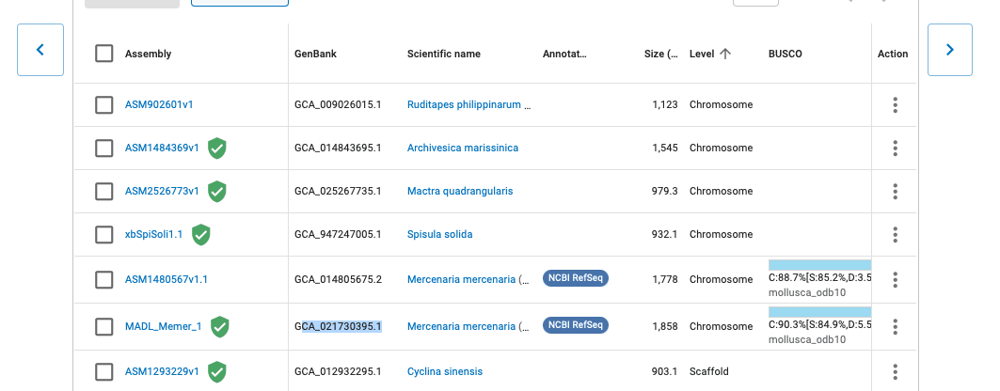

There are several key data tables to look at deep expression of tissue.
I will provide urls here as in most cased will / could read into R from
url.

# Expression data

-   <https://raw.githubusercontent.com/sr320/paper-geoduck-gene-exp/main/data/salmon.merged.gene_tpm.tsv>

# Gene Annotation

-   <https://raw.githubusercontent.com/RobertsLab/code/master/r_projects/sam/20230328-pgen-gene_annotation-update/outputs/02-goslim-mapping/20230329-pgen-annotations-SwissProt-GO-BP_GOslim.tab>

more info at <https://github.com/RobertsLab/resources/issues/1602>

# Other clam genomes

    

URL <https://www.ncbi.nlm.nih.gov/data-hub/genome/?taxon=6580>

## Ruditapes philippinarum

<https://www.ncbi.nlm.nih.gov/data-hub/taxonomy/129788/>

mRNA

    head ../data/Rphil-mrna.fa

how to get that <https://d.pr/i/eARMYF>

## Archivesica marissinica

    cd ../data
    curl -OJX GET "https://api.ncbi.nlm.nih.gov/datasets/v2alpha/genome/accession/GCA_014843695.1/download?include_annotation_type=GENOME_FASTA,GENOME_GFF,RNA_FASTA,CDS_FASTA,PROT_FASTA,SEQUENCE_REPORT&filename=GCA_014843695.1.zip" -H "Accept: application/zip"

    cd ../data
    unzip GCA_014843695.1.zip

Genome only

## Mactra quadrangularis

    cd ../data
    /home/shared/datasets \
    download genome accession GCA_025267735.1 \
    --include gff3,rna,cds,protein,genome,seq-report --filename GCA_025267735.1.zip

    cd ../data
    unzip GCA_025267735.1.zip

## Spisula solida

    cd ../data
    /home/shared/datasets \
    download genome accession GCA_947247005.1 \ --include gff3,rna,cds,protein,genome,seq-report \ --filename GCA_947247005.1.zip

## Mercenaria mercenaria

paper
<https://bmcgenomics.biomedcentral.com/articles/10.1186/s12864-021-08262-1#availability-of-data-and-materials>

    cd ../data
    /home/shared/datasets \
    download genome accession GCF_021730395.1 --include gff3,rna,cds,protein,genome,seq-report --filename GCF_021730395.1.zip
